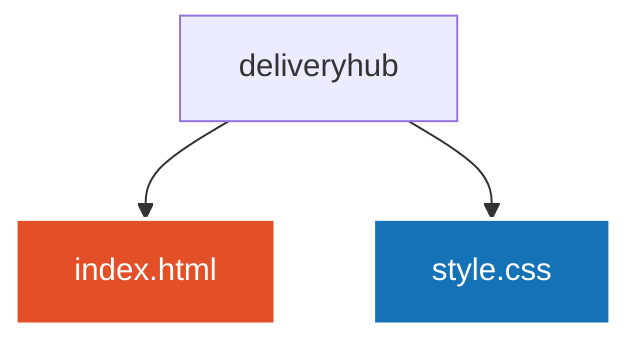

# DeliveryHUB 🍔🛵


> ⚠️ **Observação :** Este projeto foi desenvolvido **apenas para fins de estudo e portfólio**. O **DeliveryHUB** não é um estabelecimento real, nenhum produto está à venda e o número de WhatsApp informado nos botões é meramente fictício (gerado para testes de integração).
> Landing page moderna e responsiva para a hamburgueria artesanal DeliveryHUB, focada em conversão rápida de pedidos via WhatsApp.

---

## 💻 Sobre o Projeto

O **DeliveryHUB** é uma plataforma web criada com o objetivo de apresentar o cardápio de uma hamburgueria artesanal de forma atraente, intuitiva e direta. Através de um layout focado em alta conversão e experiência do usuário (UX/UI), os clientes podem visualizar fotos dos pratos, preços, badges de destaques, depoimentos/métricas e realizar seus pedidos instantaneamente pelo WhatsApp.

O projeto traz uma navegação rápida por seções (Início, Cardápio, Sobre e Contato), além de reforçar a identidade visual da marca com selos de garantia e depoimentos.

---

## ⚙️ Funcionalidades

- **Navegação Dinâmica e Âncoras:** Links rápidos para navegar suavemente entre as seções da página (`#home`, `#cardapio`, `#sobre`, `#contato`).
- **Métricas de Impacto:** Seção de destaque com provas sociais (`+500 Clientes`, `Avaliação 4.8`, `Garantia de 40min`).
- **Cardápio Interativo com Badges:** Apresentação visual dos pratos com preços e selos de destaque (*Mais vendido*).
- **Integração com WhatsApp:** Botões de CTA (Call to Action) direcionando direto para a conversa no WhatsApp com mensagem personalizada preenchida.
- **Seção "Nossa História":** Apresentação dos pilares do restaurante (carne selecionada, entrega rápida e pagamento facilitado).
- **Informações Institucionais:** Rodapé completo com horários de funcionamento, telefone, endereço e redes sociais.

---

## 📊 Cardápio em Destaque

Abaixo está uma amostra dos principais itens disponíveis no cardápio do DeliveryHUB:

| Item | Descrição | Preço | Destaque |
| :--- | :--- | :---: | :---: |
| **Hambúrguer Clássico** | Pão brioche, carne bovina, cheddar, alface, tomate, picles e molho | R$ 22,90 | 🔥 Mais vendido |
| **X-Bacon** | Pão artesanal, carne bovina, fatias de bacon, queijo e maionese | R$ 24,90 | 🔥 Mais vendido |
| **X-Salada** | Pão de hambúrguer, carne bovina, queijo, alface e tomate | R$ 20,99 | — |
| **CheeseBurger** | Pão de hambúrguer, carne bovina e queijo cheddar | R$ 19,90 | — |
| **Batata Frita + Cheddar e Bacon** | Batatas crocantes com cheddar cremoso e bacon | R$ 15,50 | 🔥 Mais vendido |
| **Milkshake de Chocolate** | Milkshake cremoso de chocolate com calda especial | R$ 14,90 | — |

---

## 🛠️ Tecnologias Utilizadas

- **HTML5:** Estruturação semântica e acessível do código, com uso correto de tags como `<header>`, `<nav>`, `<section>`, `<article>`, `<figure>` e `<footer>`.
- **CSS3:** Estilização visual (arquivo `style.css`), responsável pelo layout responsivo, tipografia, cores da marca e efeitos nos botões.

---

## 🌎 Teste meu projeto no seu navegador! 

- 🍔 **Deliveryhub:** [VEJA ESTE PROJETO NO SEU NAVEGADOR!](https://deliveryhhub.netlify.app)

---

## 🚀 Como Executar o Projeto Localmente

### Pré-requisitos
- Um navegador web moderno (Google Chrome, Firefox, Edge, etc.).
- [Git](https://git-scm.com) instalado na máquina.
- Um editor de código como o [VS Code](https://code.visualstudio.com/) (opcional).

### ☕ Passo a Passo

1. **Clone este repositório:**
   ```bash
   git clone https://github.com/AliceSilva2012/deliveryhub.git
   ```

2. **Acesse a pasta do projeto:**
   ```bash
   cd deliveryhub
   ```

3. **Execute a aplicação:**
   - Dê um duplo clique no arquivo `index.html` para abri-lo no navegador, ou
   - Clique com o botão direito no `index.html` e selecione **Open with Live Server**.

---

## 📁 Estrutura de Arquivos


